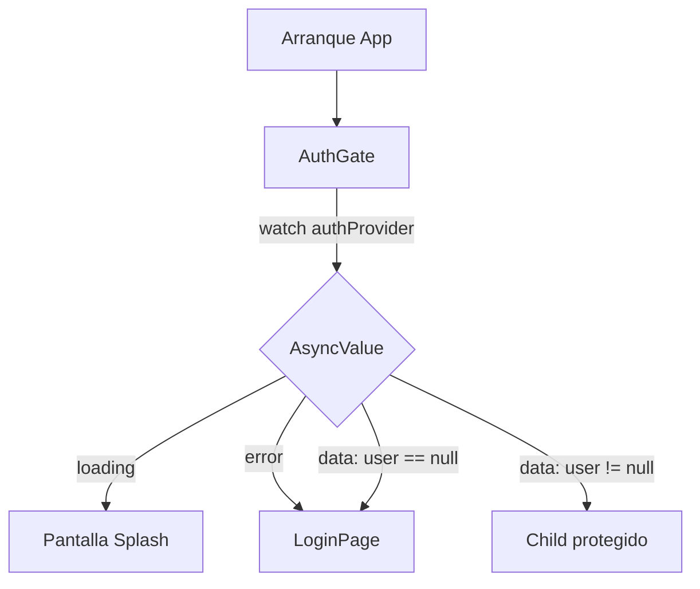

# Flutter Config Mínima (MVC por feature + Riverpod)

Proyecto base en Flutter con arquitectura **por features** y patrón **MVC ligero**:
- **Model** → `data/models`
- **Controller** → `controllers` (con **Riverpod** `AsyncNotifier`)
- **View** → `presentation/pages` y `presentation/widgets`

Incluye:
- **Login** simulado con persistencia en **SharedPreferences**
- **Listado de todos** en memoria (array) con add/toggle/delete
- **Preferencias** con tema oscuro persistente
- **AuthGate** reutilizable (sin router): muestra Login si no hay sesión o el widget protegido si la hay

> En **Web**, `shared_preferences` usa `localStorage`: persiste por navegador y dominio, pero se pierde en incógnito o si borras datos del sitio.

---

## 📦 Paquetes clave

- [`flutter_riverpod`](https://pub.dev/packages/flutter_riverpod) – estado reactivo con `AsyncNotifier`
- [`shared_preferences`](https://pub.dev/packages/shared_preferences) – persistencia local de token/email/preferencias
- [`equatable`](https://pub.dev/packages/equatable) – igualdad estructural en modelos

---

## 🗂️ Estructura de carpetas

```
lib/
├── core/
│   └── theme/
│       └── app_theme.dart
├── shared/
│   ├── presentation/
│   │   └── widgets/
│   │       ├── app_drawer.dart
│   │       └── auth_gate.dart
│   └── utils/
│       └── string_validators.dart
├── features/
│   ├── auth/
│   │   ├── controllers/
│   │   │   └── auth_controller.dart
│   │   ├── data/
│   │   │   ├── models/
│   │   │   │   └── user.dart
│   │   │   └── repositories/
│   │   │       └── auth_repository.dart
│   │   └── presentation/
│   │       └── pages/
│   │           └── login_page.dart
│   ├── todos/
│   │   ├── controllers/
│   │   │   └── todo_controller.dart
│   │   ├── data/
│   │   │   ├── models/
│   │   │   │   └── todo.dart
│   │   │   └── repositories/
│   │   │       └── todo_repository.dart
│   │   └── presentation/
│   │       └── pages/
│   │           └── todo_list_page.dart
│   └── preferences/
│       ├── controllers/
│       │   └── preferences_controller.dart
│       ├── data/
│       │   ├── models/
│       │   │   └── preferences.dart
│       │   └── repositories/
│       │       └── preferences_repository.dart
│       └── presentation/
│           └── pages/
│               └── preferences_page.dart
└── main.dart
```

---

## 🚀 Puesta en marcha

1. **Instalar dependencias**
   ```bash
   flutter pub get
   ```

2. **Ejecutar**
   ```bash
   flutter run
   ```

3. **Punto de entrada**
   - `main.dart` monta `MaterialApp` con `AppTheme` y pone como `home` el `AuthGate(child: TodoListPage())`.
   - `AuthGate` decide en tiempo de ejecución si renderizar **Login** o el **child protegido**.

4. **Credenciales de ejemplo**
   - Email válido (regex simple) y contraseña **≥ 4** caracteres.
   - Tras login se guarda `email` y `token_*` en `SharedPreferences`.

---

## 🧠 Estado y controladores (Riverpod)

### Auth

- **Provider**: `authControllerProvider`  
- **Notifier**: `AuthController extends AsyncNotifier<User?>`
  - `build()` restaura sesión leyendo `token`/`email` del repositorio.
  - `login(email, password)` valida, guarda en `SharedPreferences`, publica `User` y refresca.
  - `logout()` limpia `SharedPreferences` y pone `AsyncData(null)`.

**Uso (en AuthGate):**
```dart
final authAsync = ref.watch(authControllerProvider);
return authAsync.when(
  data: (user) => user == null ? const LoginPage() : child,
  loading: () => const Scaffold(body: Center(child: CircularProgressIndicator())),
  error: (_, __) => const LoginPage(),
);
```

### Todos

- **Provider**: `todosProvider` (`AsyncNotifier<List<Todo>>`)
- **Notifier**: `TodosNotifier`
  - `build()` carga el array simulado desde `TodoRepository`
  - `add / toggle / remove` mutan y luego recargan con `AsyncValue.guard`
- **Selector**: `totalTodosProvider` (longitud de la lista)

**Uso:**
```dart
final todosAsync = ref.watch(todosProvider);
todosAsync.when(
  data: (items) => ListView.builder(...),
  loading: () => const Center(child: CircularProgressIndicator()),
  error: (e, _) => Center(child: Text('Error: $e')),
);
```

### Preferencias

- **Provider**: `preferencesProvider`
- **Notifier**: `PreferencesNotifier extends AsyncNotifier<Preferences>`
  - `build()` carga las preferencias almacenadas
  - `updatePreferences()` aplica modo `loading`, persiste, actualiza optimista y refresca

---

## 🔐 AuthGate (sin router)

`AuthGate` es un **widget reutilizable** que envuelve cualquier pantalla protegida:

```dart
class AuthGate extends ConsumerWidget {
  const AuthGate({super.key, required this.child});
  final Widget child;

  @override
  Widget build(BuildContext context, WidgetRef ref) {
    final authAsync = ref.watch(authControllerProvider);
    return authAsync.when(
      data: (user) => user == null ? const LoginPage() : child,
      loading: () => const Scaffold(body: Center(child: CircularProgressIndicator())),
      error: (err, _) => const LoginPage(),
    );
  }
}
```

### Diagrama de flujo (Mermaid)



---

## 💾 Persistencia

- **AuthRepository**: guarda `email` y `token` (o el `User` serializado) en `SharedPreferences`.
- **PreferencesRepository**: guarda/lee `Preferences` (p. ej. tema oscuro).

> En **Flutter Web**, `shared_preferences` usa `localStorage`. Cambiar de dominio, usar incógnito o borrar datos del sitio borrará la sesión. Para mayor robustez en Web: `Hive`/`Drift` (IndexedDB) o un backend remoto.

---

## 🧪 Comportamiento esperado

- **Login**: al iniciar sesión, la UI pasa de `LoginPage` al contenido protegido.
- **Logout**: se limpia sesión y vuelve a `LoginPage`.
- **Todos**: añadir, marcar/desmarcar, eliminar. Recarga posterior desde repositorio.
- **Preferencias**: conmutador de **tema oscuro** persistente.

---

## 🛠️ Extensiones y mejoras

- Serializar el `User` completo en una sola clave de `SharedPreferences`.
- Añadir `flutter_localizations` y `intl`.
- Tests de `AsyncNotifier` con `ProviderContainer`.
- Navegación declarativa (`go_router`) si la app crece (manteniendo `AuthGate` como guardia).

---

## ▶️ Comandos útiles

```bash
# Ejecutar
flutter run

# Formatear
dart format lib

# Analizar
flutter analyze
```

---

## 📜 Licencia

MIT (o la que prefieras).